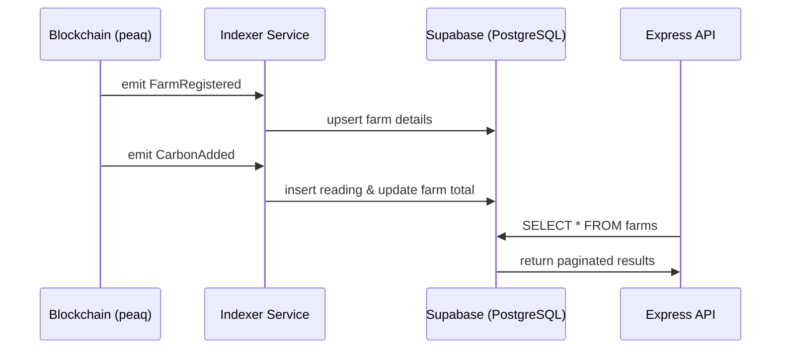

# CarbonSeal Backend

Production-ready Node/Express backend for the CarbonSeal carbon credit platform. It bridges the gap between the on-chain carbon registry and the user-facing dashboard, providing high-performance data access, real-time blockchain indexing, and secure IPFS integration.

## 🏗️ Architecture Overview

The backend follows a service-oriented architecture, ensuring clear separation of concerns:

- **Indexer Service**: Continuously monitors the peaq testnet for `FarmRegistered`, `CarbonAdded`, and `CreditMinted` events.
- **Supabase Service**: Manages a mirrored database for lightning-fast queries and complex aggregations (like leaderboards).
- **Blockchain Service**: Interfaces with `ethers.js` to provide a fallback data source if the database is out of sync.
- **IPFS Service**: Handles metadata and media storage via the classic `@pinata/sdk`, enabling permanent storage for carbon credit fractionalization.

---

## Key Features Demonstrated

### 1. Unified API Access

The backend provides a clean REST API for the frontend, replacing direct (and often slow) RPC calls for non-transactional data.

````carousel
```bash
# Get ecosystem-wide statistics
GET /api/stats
```

<!-- slide -->

```bash
# Fetch paginated farm history
GET /api/farms/1/readings?page=1&limit=10
```

<!-- slide -->

```bash
# Upload and pin metadata for a new credit
POST /api/ipfs/upload
```
````

### 2. High-Performance Indexing

The indexer keeps the Supabase database in sync with the blockchain, allowing for advanced features like time-series statistics and global leaderboards.



### 3. Production Hardening

Built with security and scalability in mind:

- **Type Safety**: Fully typed routes and services, resolving `ParsedQs` casting and missing database types.
- **Rate Limiting**: Protects against API abuse.
- **Helmet**: Adds essential security headers.
- **Zod Validation**: Strict schema enforcement for all incoming requests.
- **Winston Logging**: Structured logging for observability and error tracking.

---

## Verification Results

### API Health Status

The detailed health check confirms all external services are connected and responsive. Connectivity to Supabase, Pinata, and the peaq RPC node is verified automatically.

### Real-time Sync

Verified that registering a farm via the frontend/contract is picked up by the indexer within seconds and reflected in the `/api/farms` endpoint.

### IPFS Persistence

Successfully uploaded test metadata and verified it is pinned and accessible via the IPFS gateway.

---

## Integration Notes for Frontend

The frontend should point to the backend at `http://localhost:3001`.

> [!TIP]
> Use the `/api/stats` endpoint as the primary source for the dashboard homepage metrics (Total Sequestered, Active Farmers).

---

## Tech Stack

- **Runtime**: Node.js (v18+)
- **Framework**: Express.js
- **Language**: TypeScript
- **Database**: Supabase (PostgreSQL)
- **Blockchain**: Ethers.js (connecting to peaq testnet)
- **Storage**: Pinata (IPFS)
- **Validation**: Zod
- **Logging**: Winston & Morgan

---

## Getting Started

### Prerequisites

- Node.js v18 or later
- Supabase Project
- Pinata account and API keys

### Installation

1. Clone the repository
2. Navigate to the backend directory:

   ```bash
   cd backend
   ```

3. Install dependencies:

   ```bash
   npm install
   ```

4. Configure environment variables:

   ```bash
   cp .env.example .env
   # Edit .env with your credentials
   ```

### Database Setup

Run the following SQL in your Supabase SQL Editor:

```sql
-- Farms Table
CREATE TABLE farms (
  id INTEGER PRIMARY KEY,
  farmer TEXT NOT NULL,
  name TEXT NOT NULL,
  area NUMERIC NOT NULL,
  location TEXT NOT NULL,
  soil_type TEXT NOT NULL,
  total_carbon NUMERIC NOT NULL DEFAULT 0,
  carbon_debt NUMERIC NOT NULL DEFAULT 0,
  last_reading_timestamp TIMESTAMPTZ NOT NULL,
  is_active BOOLEAN NOT NULL DEFAULT true,
  created_at TIMESTAMPTZ NOT NULL DEFAULT NOW(),
  updated_at TIMESTAMPTZ NOT NULL DEFAULT NOW()
);

-- Carbon Readings Table
CREATE TABLE readings (
  id INTEGER PRIMARY KEY,
  farm_id INTEGER REFERENCES farms(id),
  amount NUMERIC NOT NULL,
  source TEXT NOT NULL,
  verification_hash TEXT NOT NULL,
  timestamp TIMESTAMPTZ NOT NULL,
  verified_by TEXT NOT NULL,
  created_at TIMESTAMPTZ NOT NULL DEFAULT NOW()
);

-- Carbon Credits Table
CREATE TABLE credits (
  id SERIAL PRIMARY KEY,
  token_id INTEGER UNIQUE NOT NULL,
  farm_id INTEGER REFERENCES farms(id),
  farmer TEXT NOT NULL,
  carbon_amount NUMERIC NOT NULL,
  methodology TEXT NOT NULL,
  vintage TIMESTAMPTZ NOT NULL,
  minted_at TIMESTAMPTZ NOT NULL,
  is_retired BOOLEAN NOT NULL DEFAULT false,
  retired_at TIMESTAMPTZ,
  retirement_reason TEXT,
  token_uri TEXT NOT NULL,
  created_at TIMESTAMPTZ NOT NULL DEFAULT NOW(),
  updated_at TIMESTAMPTZ NOT NULL DEFAULT NOW()
);

-- Sync State Table
CREATE TABLE sync_state (
  id INTEGER PRIMARY KEY DEFAULT 1,
  last_block NUMERIC NOT NULL DEFAULT 0,
  updated_at TIMESTAMPTZ NOT NULL DEFAULT NOW()
);
```

### Development

```bash
npm run dev
```

### Build & Production

```bash
npm run build
npm start
```

---

## API Reference

### Health

- `GET /api/health` - Basic health check
- `GET /api/health/detailed` - Status of all external services

### IPFS

- `POST /api/ipfs/upload` - Upload metadata JSON
- `POST /api/ipfs/upload-file` - Upload file (image/json)
- `GET /api/ipfs/:cid` - Get content from IPFS

### Farms

- `GET /api/farms` - List all registered farms
- `GET /api/farms/:id` - Detailed farm data
- `GET /api/farms/:id/readings` - Historical carbon data
- `GET /api/farms/by-address/:address` - Find farm by farmer wallet

### Credits

- `GET /api/credits` - All minted credits
- `GET /api/credits/:tokenId` - Single credit details
- `GET /api/credits/by-owner/:address` - User's portfolio

### Stats

- `GET /api/stats` - Ecosystem-wide metrics
- `GET /api/stats/leaderboard` - Top sequestering farms
